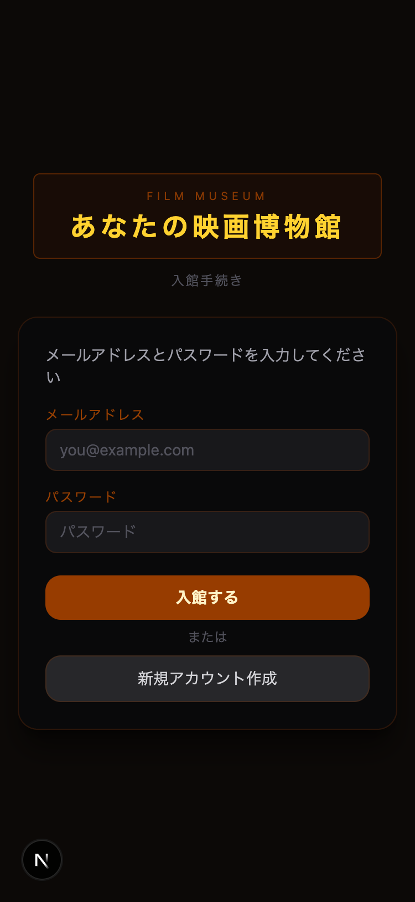
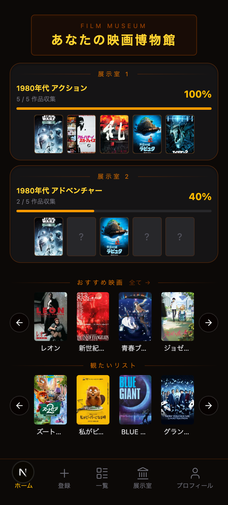
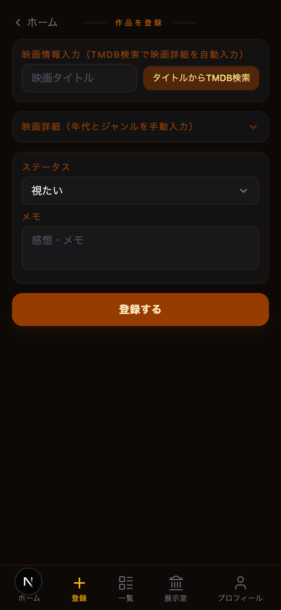
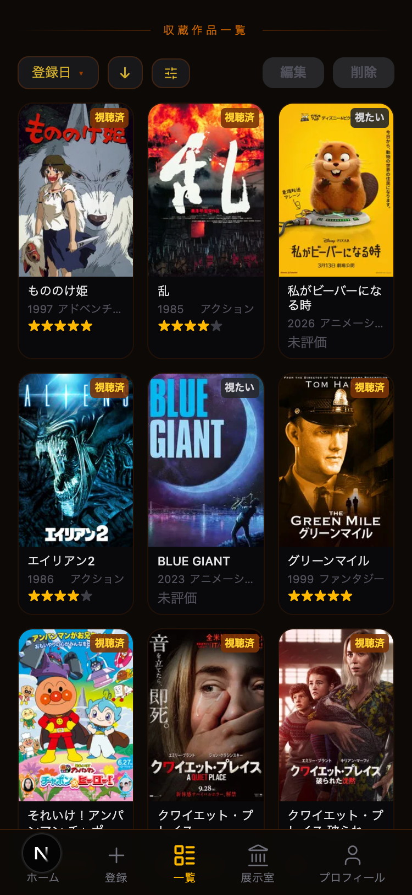
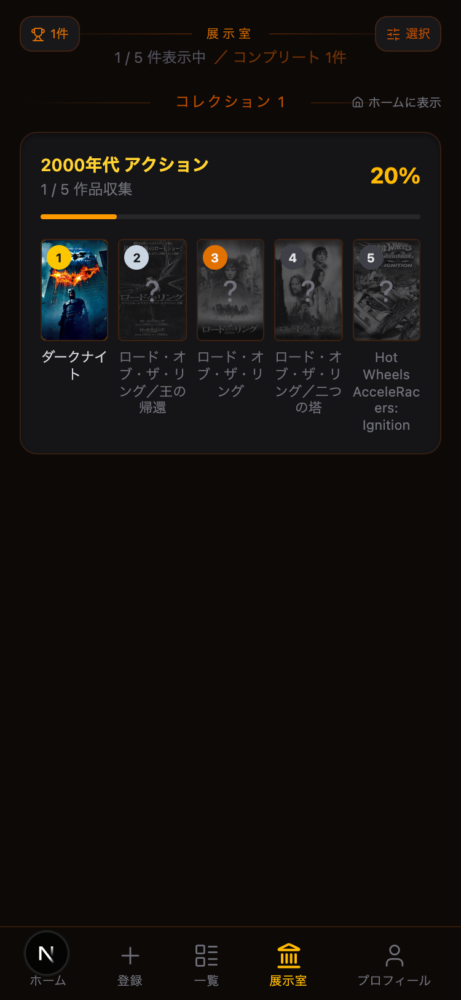
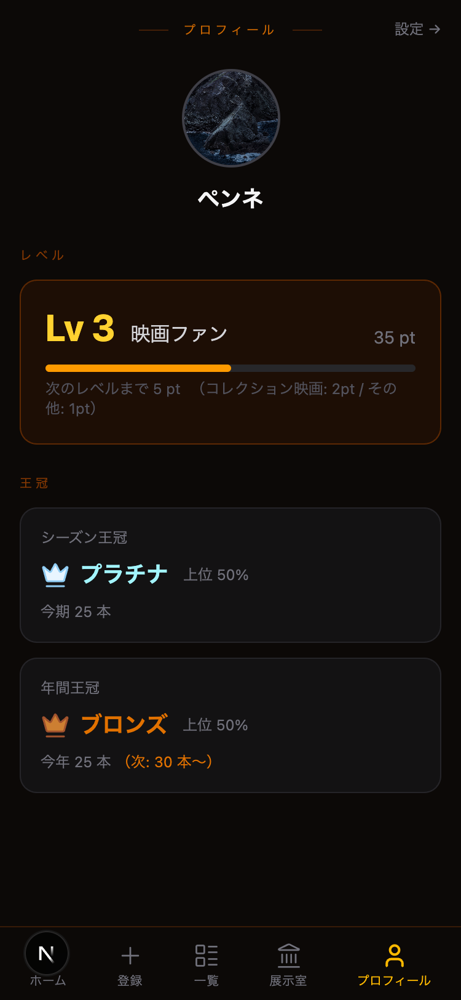
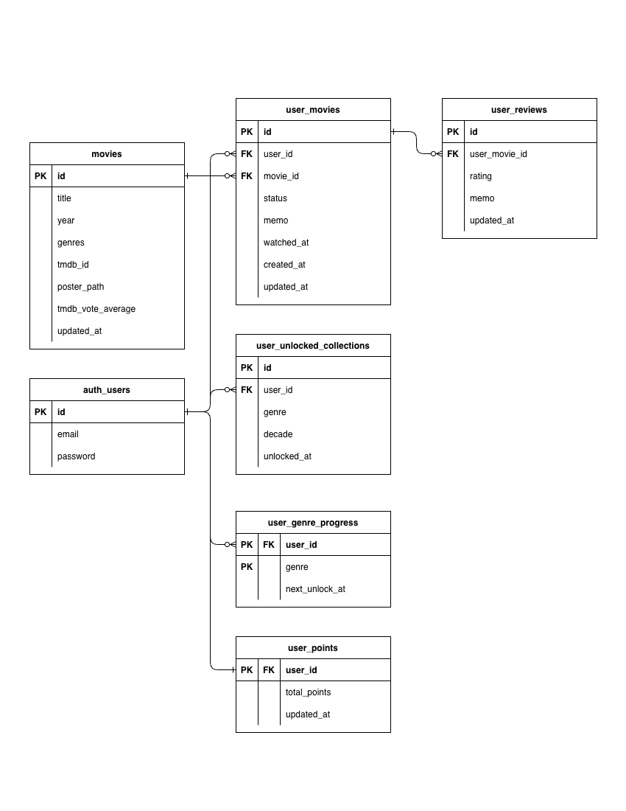
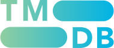

# あなたの映画博物館 / レコメンドとゲーミフィケーションで映画鑑賞がもっと楽しくなる個人向け映画記録アプリ

## アプリケーション概要

「あなたの映画博物館」は映画好きな人たちのために作成した、個人向け映画評価記録アプリです。
視聴した映画のジャンルと評価をもとに、好みに合ったおすすめ映画を表示したり、
ポスター収集によるコレクション機能でゲーミフィケーションを取り入れた視聴体験を提供します。

## スクリーンショット

## サービスURL

<URL>

## 制作背景・目的

映画鑑賞が好きなのですが、「好みに合わない映画を観てしまうことがある」「次に観る映画に迷う」という課題がありました。
また、既存の映画レビューアプリは「評価をつける」だけの作業になりがちで長続きしませんでした。
そこで、「観れば観るほどアプリ内に自分のコレクションが増えていき、映画鑑賞がもっと楽しくなる仕組み（ゲーミフィケーション）」を組み込むことで、この課題を解決できるのではないかと考え、本アプリの開発に至りました。

## 主な機能

- 認証（メールアドレスとパスワードによるログイン、新規登録）
- 映画のCRUD（TMDBと連携した簡易検索、「視聴済」「視聴希望」ステータス管理、評価（★1〜5）、感想の記録）
- フィルタ・検索（ジャンル・評価・ステータスによる絞り込み機能）
- レコメンド（★4以上の視聴済み映画のジャンル分析 → TMDB APIで週替わり表示）
- 展示室コレクション（同ジャンル3本視聴でアンロック・視聴すると映画ポスターが開放されるゲーミフィケーション設計）
- レベルとランキング機能（映画登録のたびにポイントが付与されてレベルがUP、季節/年間の視聴本数を他ユーザーと比較して
  上位何％に入ってるかによって「王冠」獲得）
- RLSによるユーザーごとのデータ保護

## 使用技術

- フレームワーク: Next.js 14 (App Router)
- 言語: TypeScript
- スタイリング: Tailwind CSS / shadcn/ui
- BaaS: Supabase (PostgreSQL / Auth / RLS)
- 外部API: TMDB API
- ホスティング: Vercel

## インフラ構成図

## ER図

## 工夫した点（アピールポイント）

レコメンドロジック:
- ★4以上の視聴済み映画のジャンルを集計し上位3ジャンルを特定。
  週番号シードでTMDB APIのページをローテーションすることで、
  毎週変わるおすすめを実現。
- コレクション解放ロジック: 
  user_genre_progressテーブルで視聴本数のしきい値を管理し、
  条件達成時に最多視聴年代のコレクションを自動解放。
- RLSによるセキュリティ:
  Supabase の Row Level Security で全テーブルのユーザーデータを保護
- Next.js Server Actions: 
  API Routeを使わずサーバー側処理をシンプルに実装

## 今後の改善案

- フォロー機能（他ユーザーのレベルや王冠の記録、コレクション閲覧）
- 記録機能の充実（獲得した称号と王冠の記録閲覧機能）
- レコメンドの精度向上（ジャンル分けに似たタグ機能の追加による、より詳細な映画の絞り込み）
- 自分の好みに似た他ユーザーの高評価映画をレコメンドして表示する機能
- ランキング機能の軽量化（RPC処理）

## TMDB APIについて
このアプリは TMDB API を使用しています。
"This product uses the TMDB API but is not
endorsed or certified by TMDB."

 → tmdb公式サイト（https://www.themoviedb.org/）